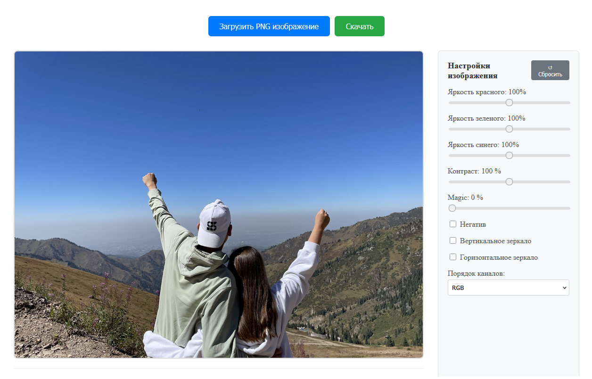
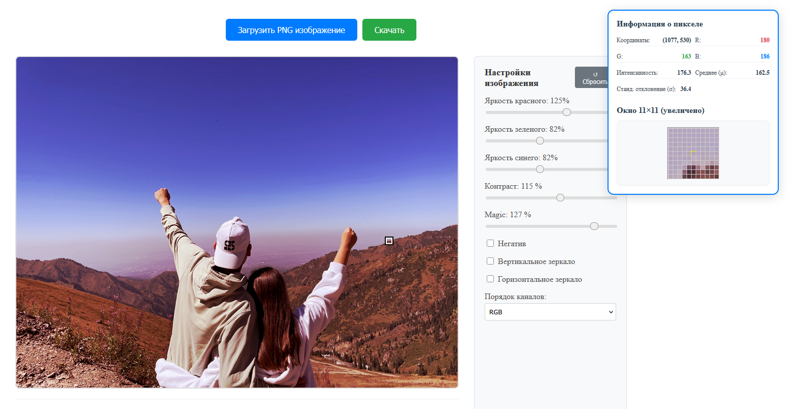
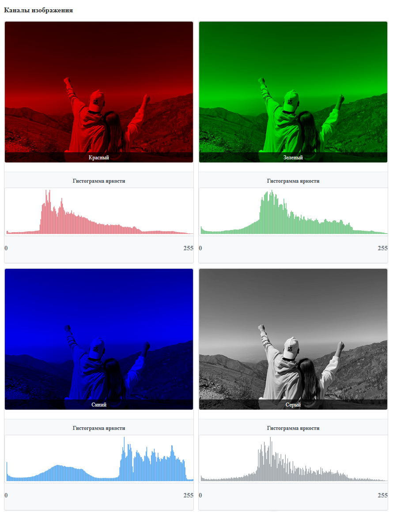

# Photo editor

A simple photo editor for changing image parameters. It serves as an example of how to manipulate an image matrix pixel by pixel using simple mathematical operations.

## Stack
<div style="display: flex;">
<div style="display: flex; align-items: center; justify-content: left; gap: 10px; padding: 20px">
    
    <span>Golang</span>
</div>
<p></p>
<div style="display: flex; align-items: center; justify-content: left; gap: 10px; padding: 20px">
    
    <span>Vue.js 3</span>
</div>
<p></p>
<div style="display: flex; align-items: center; justify-content: left; gap: 10px; padding: 20px">
    
    <span>TypeScript</span>
</div>
</div>

## Install & Start

Develop setup:
```
git clone http://https://github.com/J0hnLenin/PhotoEditor
cd ./PhotoEditor
```
Backend:
```
cd ./backend
go get -u github.com/rs/cors
go get -u github.com/gorilla/mux
go run main.go
```
Frontend:
```
cd ./frontend
npm install
npm run dev
```
open http://localhost:5173

## User interface



